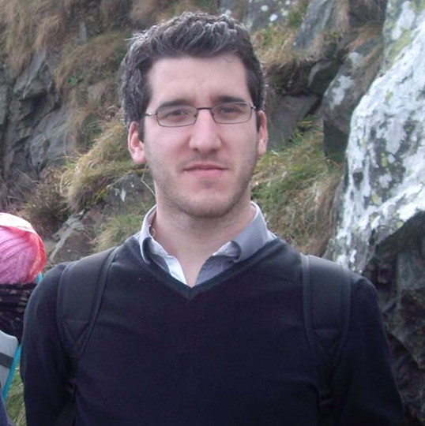

## About Me

Welcome to my personal page giving visibility to my professional activities and hobbies!

I have been a researcher in the DATA-IA entity at [Orange Labs Belfort](https://hellofuture.orange.com/fr/) since 2014.
My research focuses on the use of **knowledge engineering** in different application contexts:
* For characterization, research and recommendation and life cycle management of **datasets**.
* For the detection of illegal activities in the context of **cyber defence** projects.
* For the construction and valuation of knowledge graphs in the **Internet of Things**.

I hold a PhD (2014) from the [University of Burgundy](http://www.ubfc.fr/) and the [University College Dublin](https://www.ucd.ie/).
My work focused on the application of knowledge engineering techniques to facilitate the construction and analysis of incident timelines in the field of computer forensics.

Enjoy your visit!

## Curriculum Vitae

My CV is available here
