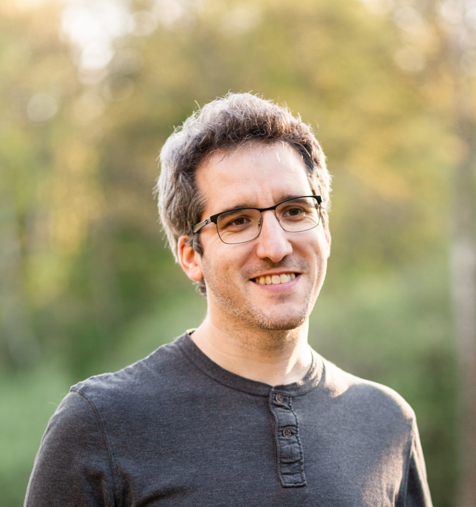

## AI Researcher and Project Manager at Orange

I have been a researcher in the DATA-IA entity at [Orange Labs Belfort](https://hellofuture.orange.com/fr/) since 2014.
My research focuses on the use of **knowledge engineering** in different application contexts:
* For characterization, research and recommendation and life cycle management of **datasets**.
* For the detection of illegal activities in the context of **cyber defence** projects.
* For the construction and valuation of knowledge graphs in the **Internet of Things**.

I hold a PhD (2014) from the [University of Burgundy](http://www.ubfc.fr/) and the [University College Dublin](https://www.ucd.ie/).
My work focused on the application of knowledge engineering techniques to facilitate the construction and analysis of incident timelines in the field of computer forensics.

Enjoy your visit!

## CV
[Curriculum Vitae](https://raw.githubusercontent.com/yoanchabot/yoanchabot.github.io/master/cv.pdf)

## Contact Infos

Email: [yoan.chabot@orange.com](mailto:yoan.chabot@orange.com)

* [Google Scholar](http://scholar.google.fr/citations?user=QKcqdfoAAAAJ)
* [dblp](https://dblp.uni-trier.de/pid/144/4841.html)
* [HAL](https://cv.archives-ouvertes.fr/yoan-chabot)
* [Twitter](https://twitter.com/yoan_chabot)
* [Research Gate](https://www.researchgate.net/profile/Yoan_Chabot/)
<!--* [Github](https://github.com/yoanchabot)-->
<!--* [Developpez.com](http://www.developpez.net/forums/u207506/metafire18)-->

> Techn Hom 3, Orange Labs
> 
> 1 rue Maurice et Louis de Broglie
> 
> 90000 Belfort, FRANCE

<!--
## Twitter Feed

    
<a class="twitter-timeline" data-width="500" data-height="250" data-tweet-limit="5" href="https://twitter.com/yoan_chabot?ref_src=twsrc%5Etfw">Tweets by yoan_chabot</a>

-->
